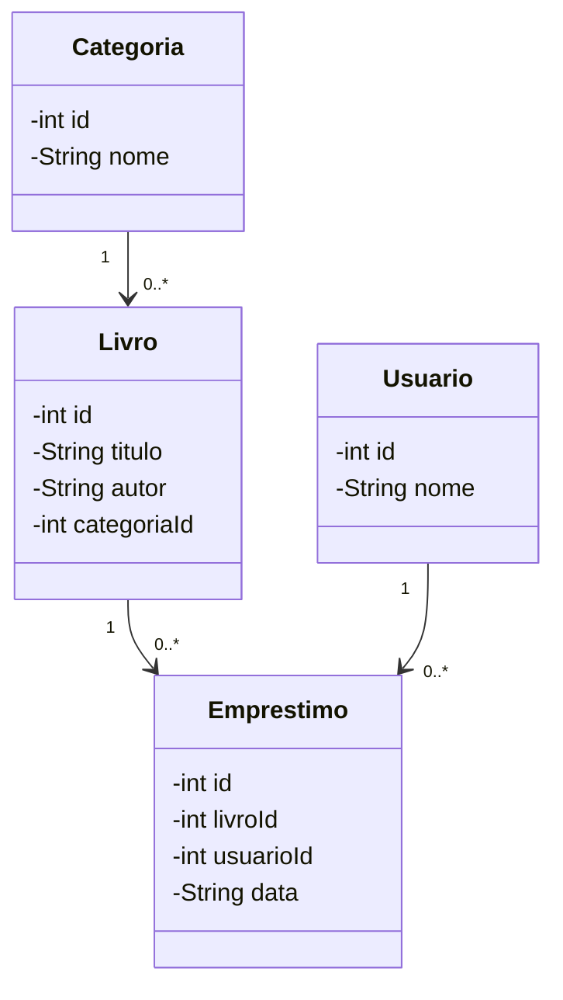
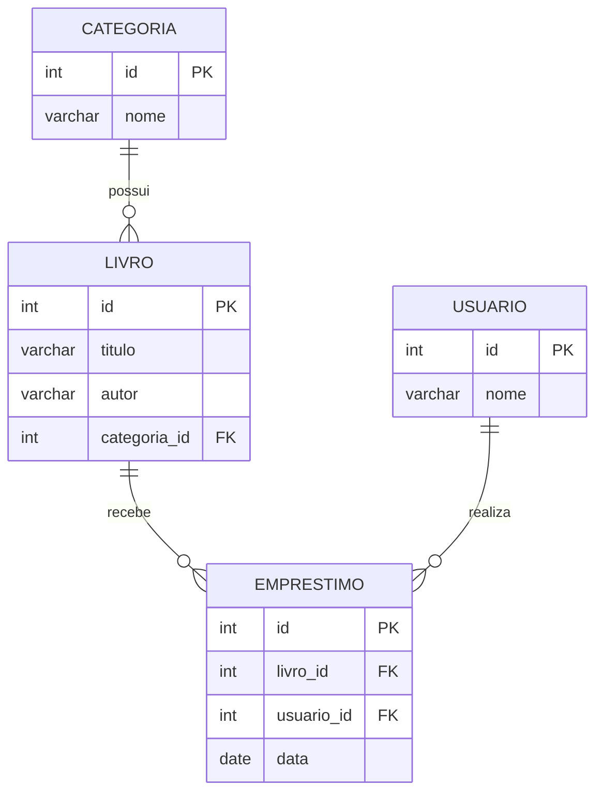

# Sistema de Biblioteca

Trabalho da faculdade de Engenharia de Software. É um sistema desktop de biblioteca feito em Java Swing, ligado a um banco MySQL por JDBC.

## Tema

Gerenciamento de uma biblioteca pequena, com cadastro de categorias, livros, usuários e empréstimos.

## Tecnologias utilizadas

- Java
- Java Swing
- JDBC
- MySQL
- Padrão MVC

## O que o sistema faz

O sistema tem quatro entidades: Categoria, Livro, Usuario e Emprestimo. A tela principal tem um botão para cada uma, e cada botão abre a tela daquela entidade.

Todas as telas funcionam do mesmo jeito. Dá para salvar um registro novo, alterar, excluir e atualizar a tabela que mostra o que está no banco. Para alterar ou excluir, é só clicar na linha da tabela.

Algumas coisas para saber na hora de usar:

- O livro guarda o ID de uma categoria, então a categoria precisa existir antes.
- O empréstimo guarda o ID de um livro, o ID de um usuário e a data no formato AAAA-MM-DD.
- Esses IDs são digitados na mão. Não existe lista para escolher.
- Se um registro estiver ligado a outro (uma categoria com livros, por exemplo), o banco não deixa excluir e o sistema avisa que não foi possível.

## Estrutura MVC

- `model`: classes das entidades.
- `view`: telas feitas com Java Swing.
- `controller`: comunicação entre as telas e o banco de dados.
- `conexao`: classe responsável pela conexão JDBC com o MySQL.

Pastas do projeto:

```text
banco/         script SQL com o banco e as tabelas
diagramas/     diagrama de classes e diagrama MER
prototipos/    protótipos das telas
src/main/java/
    conexao/
    controller/
    model/
    view/
```

## Diagrama de classes



## Diagrama MER



## Protótipos das telas

Os protótipos estão neste arquivo: [Ver protótipos](prototipos/prototipos-telas.md)

## Banco de dados

O script que cria o banco e as quatro tabelas está em `banco/biblioteca.sql`.

## Como executar

1. Rodar o script `banco/biblioteca.sql` no MySQL.
2. Adicionar o driver oficial MySQL Connector/J ao projeto.
3. Conferir usuário e senha em `src/main/java/conexao/Conexao.java`. Por padrão ele usa `root`, sem senha, em `localhost:3306`.
4. Executar a classe `TelaPrincipal`, que é a que tem o `main`.
