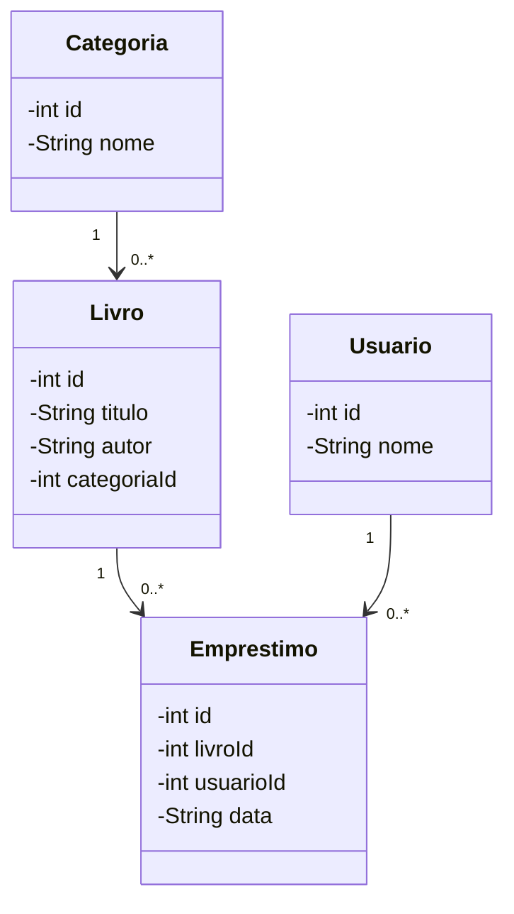

# Diagrama de Classes

```mermaid
classDiagram
    class Categoria {
        -int id
        -String nome
    }
    class Livro {
        -int id
        -String titulo
        -String autor
        -int categoriaId
    }
    class Usuario {
        -int id
        -String nome
    }
    class Emprestimo {
        -int id
        -int livroId
        -int usuarioId
        -String data
    }

    Categoria "1" --> "0..*" Livro
    Livro "1" --> "0..*" Emprestimo
    Usuario "1" --> "0..*" Emprestimo
```
