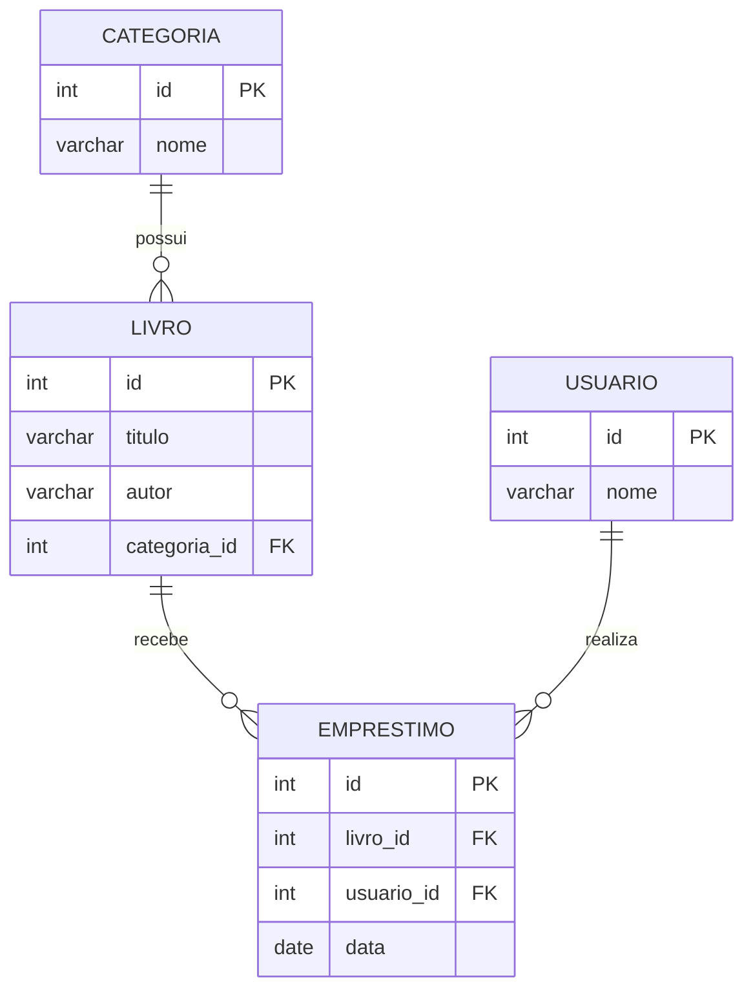

# Diagrama MER

```mermaid
erDiagram
    CATEGORIA ||--o{ LIVRO : possui
    LIVRO ||--o{ EMPRESTIMO : recebe
    USUARIO ||--o{ EMPRESTIMO : realiza

    CATEGORIA {
        int id PK
        varchar nome
    }

    LIVRO {
        int id PK
        varchar titulo
        varchar autor
        int categoria_id FK
    }

    USUARIO {
        int id PK
        varchar nome
    }

    EMPRESTIMO {
        int id PK
        int livro_id FK
        int usuario_id FK
        date data
    }
```
